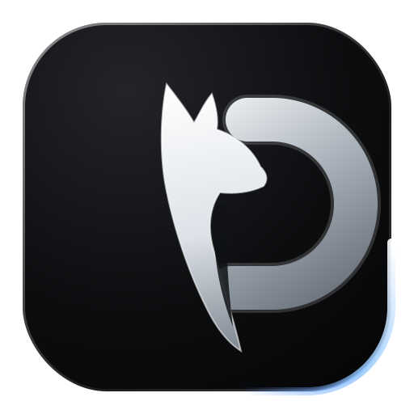

# SP3 Browser

<p align="center">
  
</p>

**Der anpassbarste Datenschutz-Browser der Welt.**
Privacy First. Security First. User Control First. Performance First.

SP3 ist ein quelloffener Browser auf Chromium-Basis (Electron) mit eingebautem
Tracker-Schutz, verschlüsseltem Passwort-Tresor und einem Theme-System ohne
Grenzen. Komplett in TypeScript, modular aufgebaut, MIT-lizenziert.

## Schnellstart

```bash
git clone https://github.com/sp3-browser/sp3-browser
cd sp3-browser
npm install
npm start
```

Installer bauen: `npm run dist` (Details in [docs/BUILD.md](docs/BUILD.md)).

## Status der Funktionen

| Funktion | Status |
|---|---|
| Tabs, Adressleiste, Suche (DuckDuckGo, Brave, Startpage, Google) | ✅ implementiert |
| Zen-artiges UI: vertikale Sidebar, schwebende Seitenkarte mit abgerundeten Ecken, Glas-Panels | ✅ implementiert |
| Sidebar mit Pinned-Grid, Workspace-Label, vertikalen Tab-Pills, Compact-Modus | ✅ implementiert |
| Command-Palette (Strg+K): Tabs wechseln, Adresse öffnen, suchen | ✅ implementiert |
| Eigene Startseite `sp3://start` mit Begrüßung, Uhr, Schnellzugriffen | ✅ implementiert |
| Adblocker und Tracker-Blocker (kuratierte Liste) | ✅ implementiert |
| HTTPS-Only-Modus mit automatischem Upgrade | ✅ implementiert |
| DNS-over-HTTPS (Cloudflare, Quad9, Mullvad, Modus „secure") | ✅ implementiert |
| Anti-Fingerprinting (Canvas-Rauschen, generischer User-Agent) | ✅ implementiert (Best-Effort, siehe SECURITY.md) |
| WebRTC-Leak-Schutz | ✅ implementiert |
| Cookie-Isolierung: Container-Tabs, temporäre Container, private Tabs | ✅ implementiert |
| Berechtigungsmanager (Deny-by-Default für Kamera/Mikrofon/Standort) | ✅ implementiert |
| Verschlüsselter Passwort-Tresor (OS-Schlüsselbund via safeStorage) | ✅ implementiert |
| Sicherheits-Dashboard mit Live-Zählern und Blockierliste | ✅ implementiert |
| Malware-/Phishing-/Scam-Schutz (SP3 Shield) mit Warnseite | ✅ implementiert (lokal, ohne Cloud-Lookups; Demo: `http://malware.sp3.test`) |
| Script-Blocker pro Tab | ✅ implementiert |
| Cookies beim Beenden löschen | ✅ implementiert |
| Theme-System: 7 Themes, Editor mit Live-Vorschau, Import/Export | ✅ implementiert |
| Vertikale Tabs (Layout-Umschaltung) | ✅ implementiert |
| Split View (zwei Tabs nebeneinander) | ✅ implementiert |
| Lokaler KI-Assistent: Zusammenfassung, Sicherheits- &amp; Datenschutzanalyse | ✅ implementiert (opt-in, via Ollama, nur localhost) |
| Screenshot-Werkzeug | ✅ implementiert |
| Auto-Update (electron-updater + GitHub Releases) | ✅ implementiert (aktiv in paketierten Builds) |
| Plugin-Architektur: Manifest-Erkennung | 🧩 Phase 1 (siehe PLUGINS.md) |
| Plugin-Sandbox und Plugin-Store | 🗺️ Roadmap |
| Theme-Marktplatz | 🗺️ Roadmap (Import/Export per JSON funktioniert) |
| EasyList/EasyPrivacy-Filterlisten | 🗺️ Roadmap |
| Verschlüsselter Sync | 🗺️ Roadmap |
| Live-Reputationslisten (URLhaus/OpenPhish) für SP3 Shield | 🗺️ Roadmap |
| Workspaces, Tab-Gruppen, Terminal-Panel, Notizen | 🗺️ Roadmap |

Vollständige Planung: [docs/ROADMAP.md](docs/ROADMAP.md)

## Projektstruktur

```
src/
  main/            Hauptprozess: Fenster, Tabs, Sicherheit, IPC
    security/      Adblocker, HTTPS-Only, DoH, Fingerprint, Berechtigungen
  preload/         contextBridge-API für die Browser-Oberfläche
  renderer/        Chrome-UI: Tabs, Panels, Theme-Editor, Dashboard
  shared/          Gemeinsame TypeScript-Typen
themes/            Vorinstallierte Themes (JSON)
assets/            Logo und App-Icon (SVG)
mockups/           UI-Mockups (SVG)
website/           Landingpage
docs/              Dokumentation
plugins/           Beispiel-Plugin und Manifest-Spezifikation
```

## Dokumentation

- [Architektur](docs/ARCHITECTURE.md)
- [Sicherheitsmodell](docs/SECURITY.md)
- [Theme-Format und Editor](docs/THEMES.md)
- [Plugin-Architektur](docs/PLUGINS.md)
- [Build, Installer, Updates](docs/BUILD.md)
- [Roadmap](docs/ROADMAP.md)

## Tastenkürzel

| Kürzel | Aktion |
|---|---|
| Strg+T | Neuer Tab |
| Strg+Umschalt+N | Neuer privater Tab |
| Strg+Alt+T | Temporärer Container-Tab |
| Strg+W | Tab schließen |
| Strg+L | Adressleiste fokussieren |
| Strg+K | Command-Palette |
| Strg+Tab / Strg+Umschalt+Tab | Tabs wechseln |
| Strg+Alt+S | Split View umschalten |
| Strg+Umschalt+S | Screenshot der Seite |
| F12 | Entwicklerwerkzeuge |

## Lizenz

MIT, siehe [LICENSE](LICENSE).
