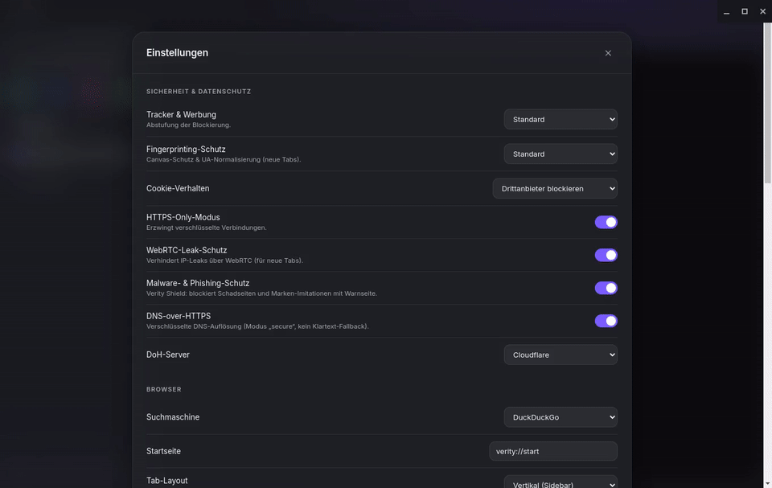
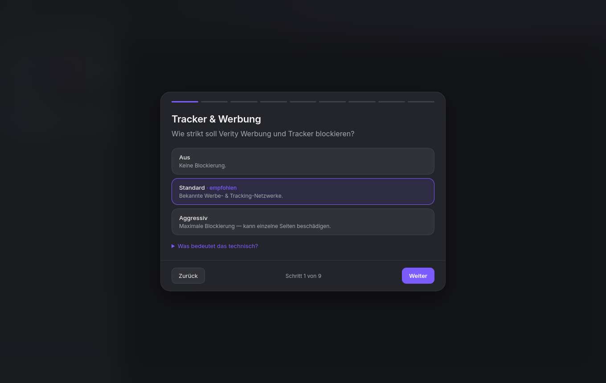
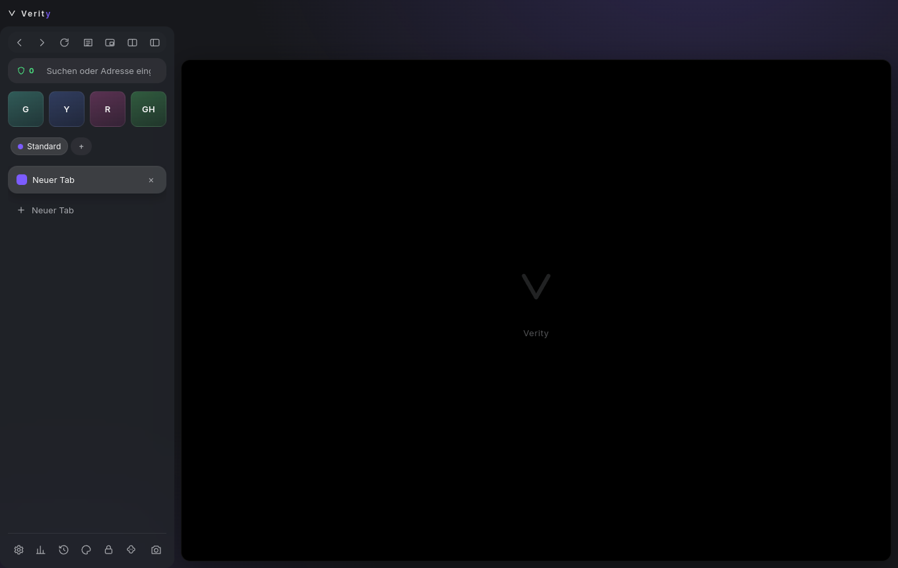
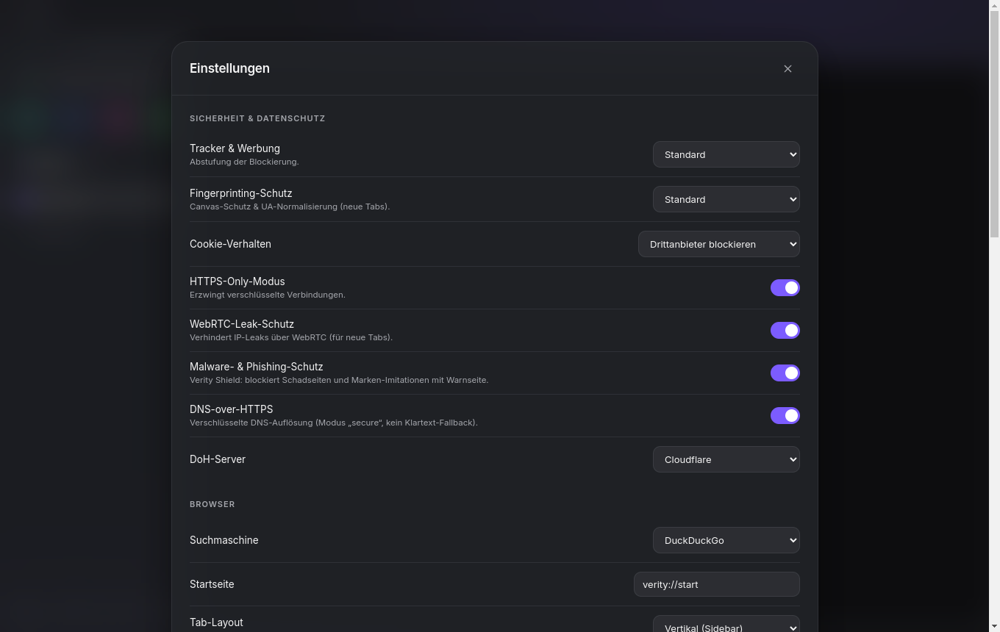
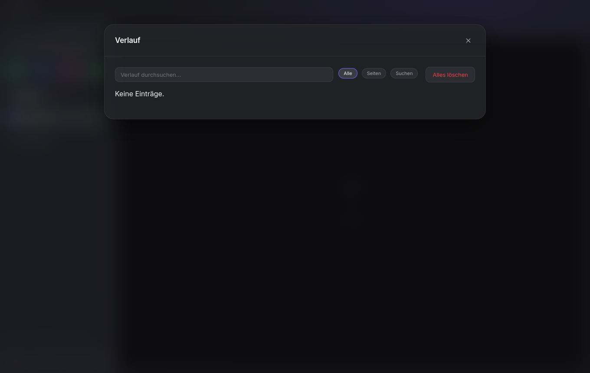
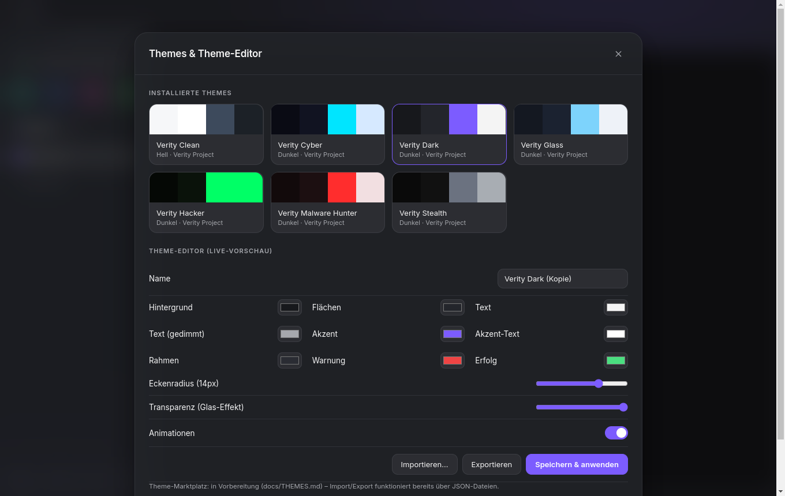
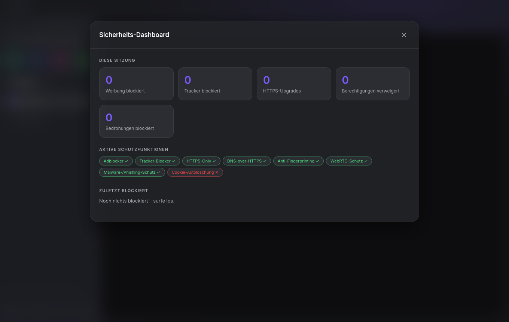

# Verity

<p align="center">
  
</p>

**Der anpassbarste Datenschutz-Browser der Welt.**
Privacy First. Security First. User Control First. Performance First.

Verity ist ein quelloffener Browser auf Chromium-Basis (Electron) mit eingebautem
Tracker-Schutz, verschlüsseltem Passwort-Tresor und einem Theme-System ohne
Grenzen. Komplett in TypeScript, modular aufgebaut, MIT-lizenziert.

> **Hinweis:** Verity ist der Nachfolger von „SP3 Browser". Alle Alt-Daten
> (Einstellungen, Theme-IDs, Startseite) werden beim ersten Start automatisch migriert.

## Vorschau



<p align="center">
  
  
</p>
<p align="center">
  
  
</p>
<p align="center">
  
  
</p>

## Neu in Verity (gegenüber SP3 Browser)

- **Privacy-Onboarding**: verpflichtender 9-Schritt-Wizard beim ersten Start — jede
  Datenschutz-Entscheidung einzeln erklärt, jederzeit in den Einstellungen änderbar.
- **Workspaces**: isolierte Arbeitsbereiche mit eigener Session-Partition
  (echte Cookie-Isolation), Akzentfarbe und Ctrl+1..9-Shortcuts.
- **Persistenter Verlauf**: optional, lokal **verschlüsselt** (OS-Keychain), mit
  getrennter Erfassung von Seiten und Suchanfragen, Retention und Suche.
- **Granulare Transparenz / Glass**: Deckkraft je UI-Bereich, Blur, Eckenradius,
  Sidebar-Seite, Compact-/Mono-Modus — mit Linux-Compositing-Erkennung.
- **Reader-Modus, Bild-in-Bild, Session-Wiederherstellung** (opt-in) und eine
  experimentelle **Mullvad-Erkennung**.

## Schnellstart

```bash
git clone https://github.com/Verit-y/verity-browser
cd verity-browser
npm install
npm start        # baut & startet
npm test         # Unit-Tests (Vitest)
```

Installer bauen: `npm run dist` (Details in [docs/BUILD.md](docs/BUILD.md)).

## Status der Funktionen

| Funktion | Status |
|---|---|
| Tabs, Adressleiste, Suche (DuckDuckGo, Brave, Startpage, Mullvad Leta, Google) | ✅ implementiert |
| Privacy-Onboarding-Wizard (9 Schritte, jederzeit erneut durchlaufbar) | ✅ implementiert |
| Workspaces mit echter Session-Isolation (Partition je Workspace), Akzentfarbe, Ctrl+1..9 | ✅ implementiert |
| Persistenter Verlauf (off / Klartext / verschlüsselt), Seiten + Suchen, Retention, Suche | ✅ implementiert |
| Granulare Transparenz/Glass (Sidebar/Toolbar/Popup, Blur, Radius, Sidebar-Seite, Compact/Mono) | ✅ implementiert |
| Reader-Modus, Bild-in-Bild, Session-Wiederherstellung (opt-in), Mullvad-Erkennung | ✅ implementiert (Mullvad experimentell) |
| SP3-Lock-Bridge für Passwörter | 🧩 Stub/Fallback (safeStorage-Tresor als Basis) |
| Zen-artiges UI: vertikale Sidebar, schwebende Seitenkarte mit abgerundeten Ecken, Glas-Panels | ✅ implementiert |
| Sidebar mit Pinned-Grid, Workspace-Switcher, vertikalen Tab-Pills, Compact-Modus | ✅ implementiert |
| Command-Palette (Strg+K): Tabs wechseln, Adresse öffnen, suchen | ✅ implementiert |
| Eigene Startseite `verity://start` mit Begrüßung, Uhr, Schnellzugriffen | ✅ implementiert |
| Adblocker und Tracker-Blocker (kuratierte Liste) | ✅ implementiert |
| HTTPS-Only-Modus mit automatischem Upgrade | ✅ implementiert |
| DNS-over-HTTPS (Cloudflare, Quad9, Mullvad, Modus „secure") | ✅ implementiert |
| Anti-Fingerprinting (Canvas-Rauschen, generischer User-Agent) | ✅ implementiert (Best-Effort, siehe SECURITY.md) |
| WebRTC-Leak-Schutz | ✅ implementiert |
| Cookie-Isolierung: Container-Tabs, temporäre Container, private Tabs | ✅ implementiert |
| Berechtigungsmanager (Deny-by-Default für Kamera/Mikrofon/Standort) | ✅ implementiert |
| Verschlüsselter Passwort-Tresor (OS-Schlüsselbund via safeStorage) | ✅ implementiert |
| Sicherheits-Dashboard mit Live-Zählern und Blockierliste | ✅ implementiert |
| Malware-/Phishing-/Scam-Schutz (Verity Shield) mit Warnseite | ✅ implementiert (lokal, ohne Cloud-Lookups; Demo: `http://malware.verity.test`) |
| Script-Blocker pro Tab | ✅ implementiert |
| Cookies beim Beenden löschen | ✅ implementiert |
| Theme-System: 7 Themes, Editor mit Live-Vorschau, Import/Export | ✅ implementiert |
| Vertikale Tabs (Layout-Umschaltung) | ✅ implementiert |
| Split View (zwei Tabs nebeneinander) | ✅ implementiert |
| Lokaler KI-Assistent: Zusammenfassung, Sicherheits- &amp; Datenschutzanalyse | ✅ implementiert (opt-in, via Ollama, nur localhost) |
| Screenshot-Werkzeug | ✅ implementiert |
| Auto-Update (electron-updater + GitHub Releases) | ✅ implementiert (aktiv in paketierten Builds) |
| Plugin-Architektur: Manifest-Erkennung | 🧩 Phase 1 (siehe PLUGINS.md) |
| Plugin-Sandbox und Plugin-Store | 🗺️ Roadmap |
| Theme-Marktplatz | 🗺️ Roadmap (Import/Export per JSON funktioniert) |
| EasyList/EasyPrivacy-Filterlisten | 🗺️ Roadmap |
| Verschlüsselter Sync | 🗺️ Roadmap |
| Live-Reputationslisten (URLhaus/OpenPhish) für Verity Shield | 🗺️ Roadmap |
| Tab-Gruppen, Sidebar-Webpanels (Notizen/Kalender), persistentes Blocker-Dashboard | 🗺️ Roadmap |
| Chrome-Extension-Unterstützung (uBO-artig) | 🗺️ Roadmap (in Electron 33 eingeschränkt) |

Vollständige Planung: [docs/ROADMAP.md](docs/ROADMAP.md)

## Projektstruktur

```
src/
  main/            Hauptprozess: Fenster, Tabs, Sicherheit, IPC
    security/      Adblocker, HTTPS-Only, DoH, Fingerprint, Berechtigungen
  preload/         contextBridge-API für die Browser-Oberfläche
  renderer/        Chrome-UI: Tabs, Panels, Theme-Editor, Dashboard
  shared/          Gemeinsame TypeScript-Typen
themes/            Vorinstallierte Themes (JSON)
assets/            Logo und App-Icon (SVG)
mockups/           UI-Mockups (SVG)
website/           Landingpage
docs/              Dokumentation
plugins/           Beispiel-Plugin und Manifest-Spezifikation
```

## Dokumentation

- [Architektur](docs/ARCHITECTURE.md)
- [Sicherheitsmodell](docs/SECURITY.md)
- [Theme-Format und Editor](docs/THEMES.md)
- [Plugin-Architektur](docs/PLUGINS.md)
- [Build, Installer, Updates](docs/BUILD.md)
- [Roadmap](docs/ROADMAP.md)

## Tastenkürzel

| Kürzel | Aktion |
|---|---|
| Strg+T | Neuer Tab |
| Strg+Umschalt+N | Neuer privater Tab |
| Strg+Alt+T | Temporärer Container-Tab |
| Strg+W | Tab schließen |
| Strg+L | Adressleiste fokussieren |
| Strg+K | Command-Palette |
| Strg+Tab / Strg+Umschalt+Tab | Tabs wechseln |
| Strg+Alt+S | Split View umschalten |
| Strg+Alt+R | Reader-Modus |
| Strg+Alt+P | Bild-in-Bild |
| Strg+1..9 | Workspace wechseln |
| Strg+Umschalt+S | Screenshot der Seite |
| F12 | Entwicklerwerkzeuge |

## Lizenz

MIT, siehe [LICENSE](LICENSE).
